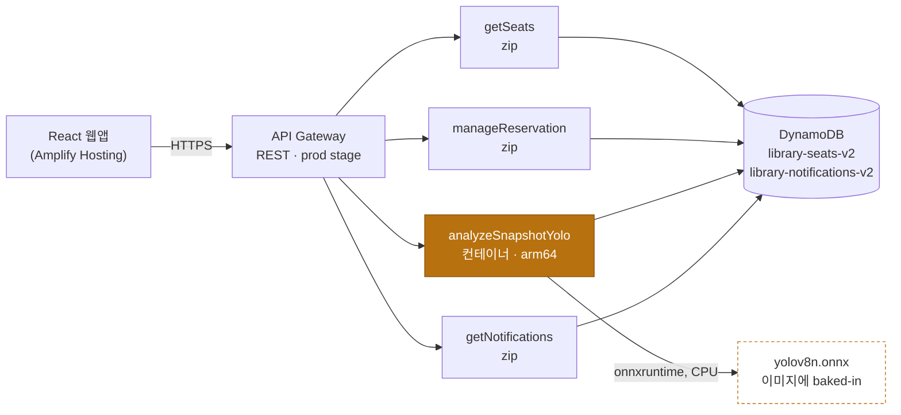
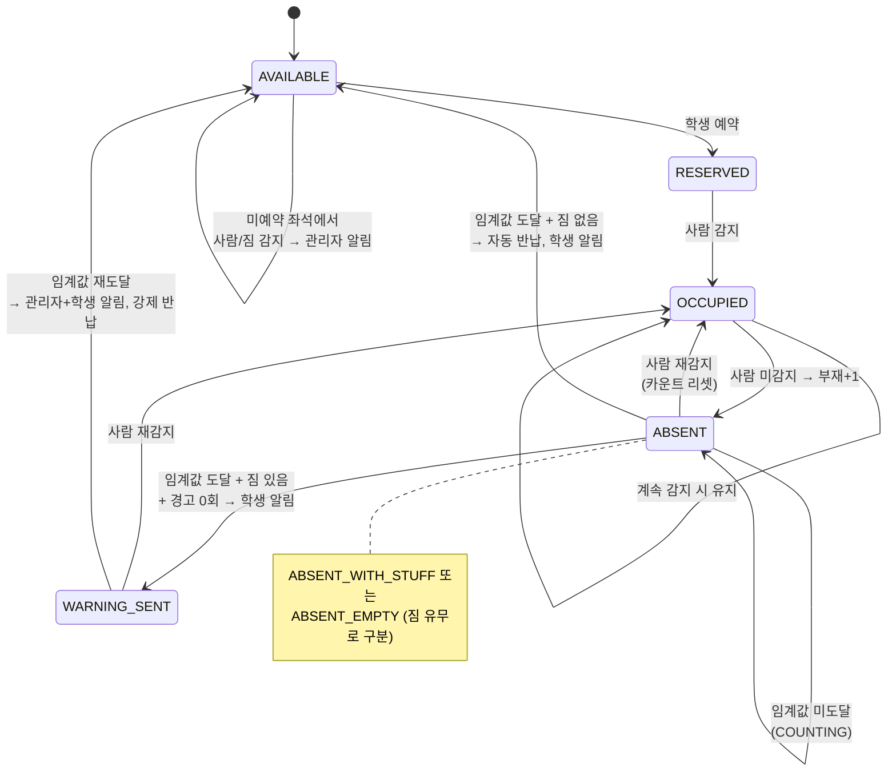
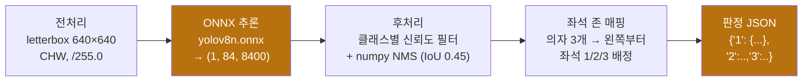
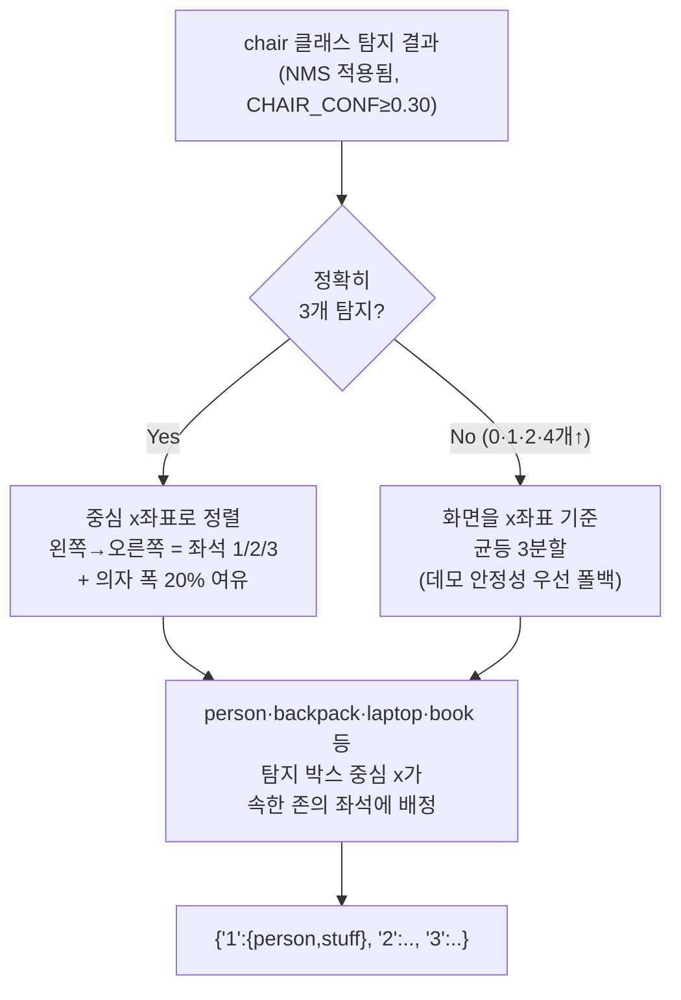

# 도서관 유령 좌석 감지 시스템 — 프로젝트 가이드 (v3)

카메라 한 대가 도서관 좌석 3개를 지켜본다. 앉아있는 사람과 짐을 스스로 구분해서, 예약만 해놓고 오지 않는 "유령 예약"을 자동으로 찾아내고 좌석을 돌려놓는다.

이 문서는 이 시스템 전체를 처음 보는 사람도 이해할 수 있게, 동시에 기술적으로도 설명할 수 있게 정리한 A-Z 가이드다. 각 섹션은 **쉽게 말하면** 요약으로 시작하고, 그 아래에서 기술적으로 더 깊이 들어간다.

> v1·v2에서는 Amazon Bedrock(Claude Haiku)에게 사진을 보내 판단을 맡겼다. v3에서는 이 호출을 걷어내고 **YOLOv8n 객체 탐지 모델을 직접 서버(Lambda)에 올려 로컬로 추론**하도록 바꿨다. 이 문서는 그 아키텍처 전체와, 특히 "카메라가 본 것을 좌석 판정으로 바꾸는" CV 파이프라인의 세부 동작을 다룬다.

**기술 스택 한눈에**: React · Vite · AWS Lambda ×4 · YOLOv8n(ONNX) · DynamoDB · API Gateway · ECR 컨테이너

---

## 목차

1. [한눈에 보기](#1-한눈에-보기)
2. [사용자 흐름](#2-사용자-흐름)
3. [시스템 아키텍처](#3-시스템-아키텍처)
4. [좌석 상태 머신](#4-좌석-상태-머신)
5. [CV 파이프라인 — YOLO가 좌석을 읽는 법](#5-cv-파이프라인--yolo가-좌석을-읽는-법)
6. [왜 Bedrock에서 YOLO로 전환했나](#6-왜-bedrock에서-yolo로-전환했나)
7. [인프라와 배포](#7-인프라와-배포)
8. [데이터 모델](#8-데이터-모델)
9. [API 엔드포인트](#9-api-엔드포인트)
10. [기술 스택](#10-기술-스택)
11. [비용 구조](#11-비용-구조)
12. [버전 히스토리](#12-버전-히스토리)

---

## 1. 한눈에 보기

> **쉽게 말하면**: 대학 도서관 좌석을 예약해놓고 실제로는 안 오거나, 가방만 던져두고 몇 시간씩 자리를 비우는 사람들이 있다. 이 시스템은 천장 카메라 사진 한 장으로 "이 자리에 사람이 앉아있나? 짐만 있나?"를 스스로 판단해서, 계속 비어있으면 경고를 보내고 그래도 안 돌아오면 자동으로 예약을 취소한다.

학생은 웹에서 좌석을 예약·취소하고 알림을 받는다. 관리자는 카메라를 켜두기만 하면 된다. 10초마다 스냅샷이 찍혀 서버로 전송되고, 서버는 사진 속에서 **사람(person)**과 **짐(가방·노트북·책 등)**을 찾아 좌석별로 상태를 판정한 뒤, 정해진 규칙(상태 머신)에 따라 좌석 상태를 바꾸고 필요하면 알림을 보낸다.

이 판정을 v1·v2에서는 Amazon Bedrock의 Claude Haiku(호스팅 비전 모델)에게 사진을 보내 맡겼다. v3에서는 이 호출을 걷어내고, YOLOv8n 객체 탐지 모델을 직접 서버(Lambda)에 올려 로컬로 추론하도록 바꿨다.

---

## 2. 사용자 흐름

> **쉽게 말하면**: 화면은 두 개뿐이다. 학생용 예약 페이지, 그리고 관리자용 카메라 대시보드.

**학생 · `/`**
학번과 이름만 입력해 로그인한다(별도 인증 없음). 비어있는 좌석 3개(A1·A2·A3) 중 하나를 예약하거나, 본인이 예약한 좌석을 취소할 수 있다. 10초마다 알림함을 폴링해서 "장시간 이탈 경고"나 "자동 반납" 알림을 확인한다.

**관리자 · `/admin`**
아이디/비밀번호(`admin / 1234`, 프론트엔드 하드코딩)로 로그인한다. **카메라 시작**을 누르면 브라우저가 웹캠 스트림을 열고, `<canvas>`에 프레임을 그려 JPEG로 인코딩한 뒤 10초마다 자동으로 서버에 전송한다. 대시보드에는 좌석 3개의 실시간 상태, 부재·경고 횟수, 상태 변화 이벤트 로그가 뜬다.

**서버 · 1회 스냅샷 처리**
이미지를 받아 YOLO로 분석 → 좌석별 `person_present` / `stuff_present` 판정 → 각 좌석의 현재 상태와 비교해 상태 전이 → DynamoDB 갱신 → 필요 시 알림 저장, 이 전체가 스냅샷 한 장당 한 번의 Lambda 실행 안에서 끝난다.

---

## 3. 시스템 아키텍처

> **쉽게 말하면**: 서버를 직접 켜두는 게 아니라, 요청이 올 때만 필요한 만큼 실행되고 끝나는 "서버리스" 구조다. 그래서 아무도 안 쓰면 비용도 거의 0원이다.

Lambda 4개는 모두 같은 두 DynamoDB 테이블을 공유한다. `analyzeSnapshotYolo`만 컨테이너 이미지로 배포되어 있고, 그 안에 YOLO ONNX 가중치가 함께 패키징되어 있다 — 나머지는 순수 Python zip 배포.

클라이언트는 4개 엔드포인트만 알면 된다. 어떤 Lambda가 어떤 형식(zip vs 컨테이너)으로 배포되어 있는지는 API Gateway 뒤로 완전히 숨겨진다 — 이건 나중에 `analyzeSnapshot`(Bedrock, zip)을 `analyzeSnapshotYolo`(YOLO, 컨테이너)로 바꿔치기할 때 프론트엔드 코드를 한 줄도 건드리지 않아도 됐던 이유이기도 하다.

---

## 4. 좌석 상태 머신

> **쉽게 말하면**: 좌석은 항상 정해진 몇 가지 상태 중 하나이고, "사람이 있다/없다"와 "짐이 있다/없다"라는 두 가지 신호만으로 다음 상태가 기계적으로 결정된다. 애매하게 판단하는 부분이 없다.

부재 카운트는 사람이 다시 감지되는 순간 0으로 리셋된다. "경고 1회 + 자동 반납 1회"가 이 시스템이 허용하는 최대 유예다.

| 현재 상태 | 조건 | 다음 상태 | 액션 |
|---|---|---|---|
| AVAILABLE | 미예약 좌석에서 사람/짐 감지 | AVAILABLE 유지 | 관리자에게 무단 점유 알림 |
| RESERVED / OCCUPIED / ABSENT_* | 사람 감지 | OCCUPIED | 부재 카운트 0으로 리셋 |
| RESERVED / OCCUPIED / ABSENT_* | 사람 미감지, 임계값 미도달 | ABSENT_WITH_STUFF / ABSENT_EMPTY | 카운트만 +1 (COUNTING) |
| ABSENT_* | 임계값 도달, 짐 없음 | AVAILABLE | 학생에게 자동 반납 알림 |
| ABSENT_* | 임계값 도달, 짐 있음, 경고 0회 | WARNING_SENT | 학생에게 경고, 카운트 리셋 후 재감시 |
| WARNING_SENT | 임계값 재도달, 짐 있음 | AVAILABLE | 관리자+학생 알림, 강제 반납 |

---

## 5. CV 파이프라인 — YOLO가 좌석을 읽는 법

> **쉽게 말하면**: 사진 한 장을 넣으면, "여기엔 의자가 있고, 저기 사람이 앉아있고, 저건 가방이다"를 숫자 좌표로 찾아낸 다음, 그 좌표들을 왼쪽부터 좌석 1·2·3으로 나눠 담는다. 이 전체가 서버 안에서 1초 안팎에 끝난다.

여기서부터가 이 프로젝트를 "Bedrock 호출"에서 "진짜 CV 파이프라인"으로 만드는 부분이다. YOLOv8n은 **COCO 데이터셋으로 이미 학습된 가중치를 그대로 쓴다**(추가 학습 없음) — 사람·의자·가방·노트북·책 등 80개 클래스를 이미 구분할 줄 안다. 이 모델을 ONNX로 변환해, `onnxruntime`만으로 Lambda 컨테이너 안에서 돌린다.

### 5.1 추론 파이프라인

런타임 의존성은 `onnxruntime` · `numpy` · `Pillow` 세 개뿐이다. 학습/변환에만 쓰는 `ultralytics`·`torch`는 Lambda에 올라가지 않는다. 전체 구현은 `tools/yolo_infer.py` — 로컬 튜닝 스크립트와 Lambda가 같은 코드를 공유한다.

### 5.2 좌석 존 매핑 — 의자 위치 기반, 실패 시 균등 3분할

YOLO는 "이게 좌석 1번이다"를 알지 못한다. 그저 박스와 클래스, 신뢰도만 뱉는다. 그래서 좌석을 나누는 규칙을 직접 정의해야 했다 — Bedrock이 하던 "왼쪽부터 순서대로 번호를 매겨줘" 같은 의미론적 판단을 기하학적 규칙으로 바꾼 것이다.

두 케이스 모두 `map_detections_to_seats()` 한 함수 안에서 처리된다. 실제 데모에서는 카메라가 의자 3개를 고르게 비출수록 왼쪽 케이스(의자 기반)로 안정적으로 들어간다. 부분 탐지 시에는 의자 위치 정밀도를 포기하는 대신 결정론적인 균등분할 폴백으로 데모가 항상 동작하도록 했다.

**사람 = "앉아있음"의 근사치.** YOLO는 자세를 모른다. 그래서 박스 높이가 화면 세로 길이의 25% 이상인 사람만 "앉아있는 사람"으로 인정한다 — 배경에서 지나가는 사람을 걸러내려는 크기 기반 근사 규칙이다. Bedrock이 하던 의미론적 판단(자세 인식)의 대체재이며, 알려진 한계다.

**짐 판정 클래스 6종.** COCO 클래스 중 `backpack · handbag · suitcase · laptop · cell phone · book` 6개를 "짐"으로 취급한다. 이 중 하나라도 좌석 존 안에서 탐지되면 `stuff_present = true`.

### 5.3 파라미터 값

| 파라미터 | 값 | 의미 |
|---|---|---|
| 입력 해상도 | `640 × 640` | letterbox 리사이즈 후 추론 입력 크기 |
| `CHAIR_CONF` | `0.30` | 의자로 인정하는 최소 신뢰도 |
| `PERSON_CONF` | `0.40` | 사람으로 인정하는 최소 신뢰도 |
| `STUFF_CONF` | `0.25` | 가방·노트북 등 소형 객체 최소 신뢰도(작아서 더 낮게) |
| NMS IoU 임계값 | `0.45` | 같은 클래스 내 중복 박스 제거 기준 |
| 좌석 존 가로 여유 | `20%` | 의자 폭 기준 좌우 패딩 |
| `PERSON_MIN_HEIGHT_RATIO` | `0.25` | "앉아있음" 근사 필터 (화면 세로 대비 박스 높이) |

---

## 6. 왜 Bedrock에서 YOLO로 전환했나

> **쉽게 말하면**: 남의 AI 서비스를 호출만 하던 것에서, 실제로 동작하는 CV 모델을 우리가 직접 배포·운영하는 것으로 바꿨다. 그래야 "컴퓨터 비전 프로젝트"라고 부를 수 있으니까.

| | v1·v2 — Bedrock Claude Haiku | v3 — YOLOv8n 로컬 추론 |
|---|---|---|
| 판단 방식 | 이미지를 base64로 인코딩해 `bedrock.invoke_model()`로 전송, 프롬프트로 판단 위임 | 가중치를 직접 소유, 전처리·추론·후처리·좌석 매핑 전 과정을 코드로 설명 가능 |
| 비용 | 호출당 과금 | Lambda 컴퓨팅 시간만 과금 (모델 호출 비용 없음) |
| 내부 동작 | 블랙박스, 응답은 텍스트 파싱 | 신뢰도 임계값·좌표 규칙을 직접 튜닝 가능 |

대가도 있다. Bedrock은 "이게 앉은 자세인지" 같은 맥락을 이해하지만 YOLO는 좌표와 클래스 확률만 준다 — 그래서 5절의 좌석 존 매핑, 박스 높이 필터 같은 명시적 규칙을 새로 설계해야 했다. 정확도의 일부를 "설명 가능성과 비용 통제"와 맞바꾼 선택이다.

---

## 7. 인프라와 배포

> **쉽게 말하면**: YOLO 모델을 담은 Docker 이미지를 만들어서 AWS의 컨테이너 저장소(ECR)에 올리고, 그 이미지로 실행되는 Lambda 함수를 하나 만들었다. 나머지 인프라(DB, API 서버)는 원래 쓰던 것 그대로다.

YOLO 런타임(`onnxruntime` 등)은 기존 Lambda의 zip 배포 용량 제한(50MB 압축)을 가볍게 넘는다. 그래서 `analyzeSnapshotYolo` 하나만 **컨테이너 이미지**로 배포 방식을 바꿨다 — 나머지 3개 Lambda는 원래처럼 순수 Python zip이다.

| 항목 | 값 |
|---|---|
| 베이스 이미지 | `public.ecr.aws/lambda/python:3.12` |
| 아키텍처 | `arm64` (Graviton) |
| 이미지 크기 | 약 1.01GB |
| 메모리 | 3008 MB |
| 타임아웃 | 25초 |
| 모델 위치 | 이미지에 baked-in (S3 미사용) |
| 레지스트리 | Amazon ECR |
| 실행 역할 | `ghost-seat-detector-lambda-role` |

메모리를 3008MB로 크게 잡은 이유는 Lambda가 **메모리에 비례해 vCPU를 할당**하기 때문이다 — CPU 추론이 병목인 워크로드라 메모리를 올리는 게 곧 추론 속도를 올리는 방법이다. 타임아웃 25초는 API Gateway REST의 하드 리밋인 29초보다 여유 있게 낮춰, 느린 콜드 스타트가 클라이언트를 무한정 붙잡지 않도록 했다.

모델 가중치(12.9MB ONNX 파일)는 S3에서 내려받지 않고 **Docker 이미지 안에 직접 포함**시켰다. 이 프로젝트가 처음부터 "이미지는 base64로 직접 전송, S3 미사용"이라는 설계 원칙을 갖고 있었고, 컨테이너 이미지는 10GB까지 지원해 12.9MB 모델을 넣는 데 아무 무리가 없었기 때문이다. 모델을 자주 교체할 계획이 없다면 이쪽이 콜드 스타트 시 네트워크 실패 지점 하나를 없애는 더 단순한 선택이다.

---

## 8. 데이터 모델

> **쉽게 말하면**: 테이블은 딱 두 개. "좌석이 지금 어떤 상태인지"와 "누구에게 어떤 알림을 보냈는지".

**`library-seats-v2`** (PK: `seat_id`)

| 속성 | 타입 | 설명 |
|---|---|---|
| `seat_id` | String | 좌석 고유 번호 (A1 / A2 / A3) |
| `status` | String | 현재 상태 (4절 상태 머신 참고) |
| `student_id` / `student_name` | String | 예약자 정보 (미예약 시 빈 문자열) |
| `absence_count` | Number | 연속 부재 횟수 |
| `warning_count` | Number | 경고 누적 횟수 (최대 1) |
| `has_stuff` | Boolean | 마지막 판정 기준 짐 유무 |
| `updated_at` | String | ISO 8601 타임스탬프 |

**`library-notifications-v2`** (PK: `student_id`, SK: `created_at`)

| 속성 | 타입 | 설명 |
|---|---|---|
| `student_id` | String | 수신자 (학번 또는 `"ADMIN"`) |
| `created_at` | String | 정렬 키, ISO 8601 |
| `type` | String | `NOTIFY_UNAUTHORIZED` / `SEND_WARNING` / `AUTO_RETURNED` 등 |
| `message` | String | 알림 본문 |
| `seat_id` | String | 관련 좌석 |

두 테이블 모두 PAY_PER_REQUEST(온디맨드) 과금 — 처리량을 미리 프로비저닝할 필요가 없다.

---

## 9. API 엔드포인트

| 경로 | 메서드 | Lambda | 설명 |
|---|---|---|---|
| `/seats` | `GET` | `getSeats` | 좌석 3개 전체 조회 |
| `/reserve` | `POST` | `manageReservation` | `action: reserve` 예약 / `cancel` 취소 |
| `/snapshot` | `POST` | `analyzeSnapshotYolo` | 스냅샷 → YOLO 분석 → 상태 전이 |
| `/notifications` | `GET` | `getNotifications` | `?student_id=` 최신 20건 조회 |

4개 모두 API Gateway **Lambda 프록시 통합(AWS_PROXY)**이다 — 요청/응답 매핑 없이 Lambda가 HTTP 요청 전체를 받고 상태 코드·헤더·바디를 직접 구성한다. CORS 헤더도 API Gateway 설정이 아니라 각 Lambda 코드(`CORS_HEADERS`)에서 직접 반환한다.

---

## 10. 기술 스택

| 구분 | 기술 |
|---|---|
| 프론트엔드 | React 19 · Vite 8 · react-router-dom 7 |
| 호스팅 | AWS Amplify |
| 백엔드 | AWS Lambda · Python 3.12 × 4개 |
| API | Amazon API Gateway (REST) |
| 데이터베이스 | Amazon DynamoDB × 2 테이블 |
| CV 모델 | YOLOv8n (COCO 사전학습) → ONNX |
| 추론 런타임 | onnxruntime (CPU) · numpy · Pillow |
| 컨테이너 | Docker · Amazon ECR · Lambda 컨테이너 이미지 (arm64) |
| IAM | Lambda 실행 역할 + DynamoDB 최소 권한 정책 |
| 리전 | us-east-1 (버지니아 북부) |

---

## 11. 비용 구조

> **쉽게 말하면**: 서버를 상시로 켜두는 구성이 아니라서, 아무도 안 쓰면 거의 0원에 가깝다.

| 리소스 | 과금 방식 | 유휴 시 비용 |
|---|---|---|
| Lambda × 4 | 호출 횟수 + 실행 시간 | `$0` |
| API Gateway | 요청 건당 | `$0` |
| DynamoDB (On-demand) | 요청 건당 + 저장 용량 | 거의 `$0` |
| ECR (이미지 저장) | GB · 월 | `~$0.10/월` |
| CloudWatch Logs | 저장 용량 | 미미함 |

Bedrock 호출 비용이 사라진 자리를 Lambda 컴퓨팅 시간이 대신하지만, 둘 다 완전 종량제라 트래픽이 없으면 비용도 없다 — EC2·RDS처럼 상시 기동 비용이 발생하는 구조가 아니다.

---

## 12. 버전 히스토리

| 항목 | v1 · 해커톤 | v2 | v3 · 현재 |
|---|---|---|---|
| AI 분석 | Bedrock Claude Haiku | Bedrock Claude Haiku | **YOLOv8n 로컬 추론** |
| Lambda 구성 | 1개 통합 | 4개 (기능별 분리) | 4개 (1개는 컨테이너) |
| 좌석 인식 | 번호표 기반 | 의자 위치 기반 | 의자 위치 + 균등분할 폴백 |
| 알림 | Slack Webhook | DynamoDB 인앱 알림 | DynamoDB 인앱 알림 |
| 배포 | 실패 | Amplify 자동 배포 | Amplify + ECR 컨테이너 |

---

*도서관 유령 좌석 감지 시스템 · 학교 AWS 해커톤 프로젝트를 컴퓨터 비전 파이프라인으로 고도화한 기록.*
